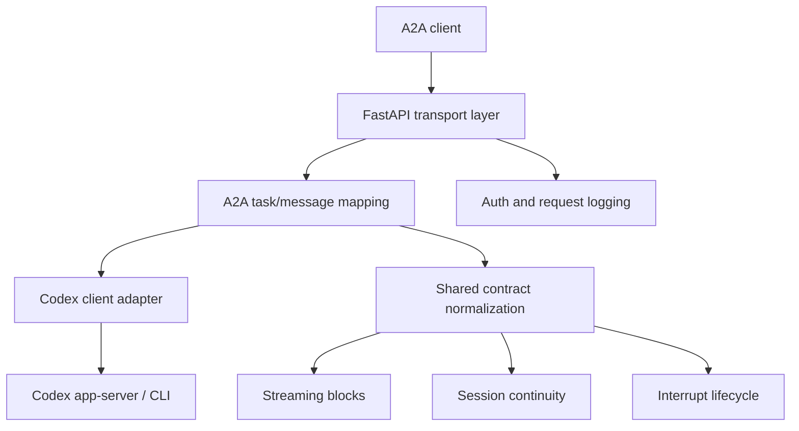

# codex-a2a-server

> Turn Codex into a stateful, production-oriented A2A agent service.

`codex-a2a-server` exposes Codex through standard A2A interfaces and adds the
operational pieces that raw agent runtimes usually do not provide by default:
authentication, session continuity, streaming contracts, interrupt handling,
deployment tooling, and documentation for running it as a service.

## Why This Project Exists

Most coding agents are built first as interactive tools, not as reusable
service endpoints. This project turns Codex into an agent service that can be
embedded into applications, gateways, and orchestration systems without
forcing each consumer to re-implement transport bridging, auth, or runtime
operations.

In practice, `codex-a2a-server` acts as:

- a protocol bridge from A2A to Codex
- a security and deployment boundary around the Codex runtime
- a stable contract layer for session, streaming, and interrupt behaviors

## Vision

Build a reusable adapter layer that lets coding agents behave like service
infrastructure rather than local-only tools:

- standard transport contracts instead of provider-specific glue
- explicit runtime boundaries instead of ad-hoc shell wrappers
- production-friendly deployment and observability instead of demo-only setups

## What It Already Provides

- A2A HTTP+JSON and JSON-RPC entrypoints for Codex
- SSE streaming with normalized `text`, `reasoning`, and `tool_call` blocks
- session continuation and session query extensions
- interrupt lifecycle mapping and callback validation
- bearer-token auth, payload logging controls, and secret-handling guardrails
- systemd multi-instance deployment and lightweight local deployment

## Logical Components



This repository does not change what Codex fundamentally is. It wraps Codex in
a service layer that makes the runtime consumable through stable agent-facing
contracts.

More detail: [Architecture Guide](docs/architecture.md)

## Current Progress

The project already has a usable service baseline for internal or controlled
deployments:

- core A2A send/stream flows are implemented
- streaming contracts are normalized around shared metadata
- interrupt ask/resolve lifecycle is surfaced explicitly
- session continuity is available through shared metadata and JSON-RPC queries
- deployment scripts cover both long-running systemd instances and lightweight
  current-user startup
- security baseline now includes `SECURITY.md`, secret scanning, and safer
  deployment defaults

## Security Model

This project improves the service boundary around Codex, but it is not a hard
multi-tenant isolation layer.

- the underlying Codex runtime may still need provider credentials
- one instance is not tenant-isolated by default
- deploy scripts default to not persisting secrets unless explicitly opted in

Read before deployment:

- [SECURITY.md](SECURITY.md)
- [Deployment Guide](docs/deployment.md)

## Recommended Client Side

If you want a client-side integration layer to consume this service, prefer
[a2a-client-hub](https://github.com/liujuanjuan1984/a2a-client-hub).

It is a better place for client concerns such as A2A consumption, upstream
adapter normalization, and application-facing integration, while
`codex-a2a-server` stays focused on the server/runtime boundary around Codex.

## Quick Start

1. Install dependencies:

```bash
uv sync --all-extras
```

2. Generate a temporary local bearer token:

```bash
export A2A_BEARER_TOKEN="$(python -c 'import secrets; print(secrets.token_hex(24))')"
```

3. Start the service:

```bash
uv run codex-a2a-server
```

4. Open the Agent Card:

- `http://127.0.0.1:8000/.well-known/agent-card.json`

For configuration, transport examples, and protocol details, use the dedicated
docs instead of the root README.

## Documentation Map

- [Architecture Guide](docs/architecture.md)
  System structure, boundaries, and request flow.
- [Usage Guide](docs/guide.md)
  Configuration, API contracts, client examples, streaming/session/interrupt
  details.
- [Deployment Guide](docs/deployment.md)
  systemd deployment, lightweight deployment, runtime secret strategy, and
  operations guidance.
- [Script Guide](scripts/README.md)
  Entry points for init, deploy, local start, and uninstall scripts.
- [Security Policy](SECURITY.md)
  Threat model, deployment caveats, and vulnerability disclosure guidance.

## Development

Baseline validation:

```bash
uv run pre-commit run --all-files
uv run pytest
```

## License

Apache License 2.0. See [LICENSE](LICENSE).
