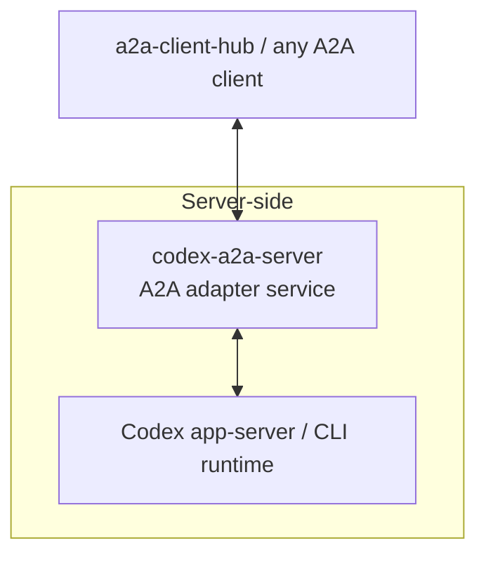

# codex-a2a-server

> Expose Codex through A2A.

`codex-a2a-server` adds an A2A service layer to the local Codex runtime, with
auth, streaming, session continuity, interrupt handling, and a clear
deployment boundary.

## What This Is

- An A2A adapter service for the local Codex runtime.
- Use it when you need a stable A2A endpoint for apps, gateways, or A2A
  clients.



## Quick Start

Install the released CLI with `uv tool`:

```bash
uv tool install codex-a2a-server
```

Upgrade later with:

```bash
uv tool upgrade codex-a2a-server
```

Install an exact release with:

```bash
uv tool install "codex-a2a-server==<version>"
```

Before starting the runtime:

- Install and verify the local `codex` CLI itself.
- Configure Codex with a working provider/model setup and any required credentials.
- `codex-a2a-server` does not provision Codex providers, login state, or API keys for you.
- Startup fails fast if the local `codex` runtime is missing or cannot initialize.

Self-start the released CLI against a workspace root:

```bash
export A2A_BEARER_TOKEN="$(python -c 'import secrets; print(secrets.token_hex(24))')"
A2A_HOST=127.0.0.1 \
A2A_PORT=8000 \
A2A_PUBLIC_URL=http://127.0.0.1:8000 \
CODEX_WORKSPACE_ROOT=/abs/path/to/workspace codex-a2a-server
```

Agent Card: `http://127.0.0.1:8000/.well-known/agent-card.json`

## What You Get

- A2A HTTP+JSON and JSON-RPC entrypoints for Codex
- SSE streaming with normalized `text`, `reasoning`, and `tool_call` blocks
- session continuation and session query extensions
- interrupt lifecycle mapping and callback validation
- bearer-token auth, payload logging controls, and secret-handling guardrails
- released-CLI startup and source-based runtime paths

Detailed protocol contracts, examples, and extension docs live in
[Usage Guide](docs/guide.md).

## When To Use It

Use this project when:

- you want to keep Codex as the runtime
- you need A2A transports and Agent Card discovery
- you want a thin service boundary instead of building your own adapter

Look elsewhere if:

- you need hard multi-tenant isolation inside one shared runtime
- you want this project to manage your process supervisor or host bootstrap
- you want a general client integration layer rather than a server wrapper

## Recommended Client Side

If you want a client-side integration layer to consume this service, prefer
[a2a-client-hub](https://github.com/liujuanjuan1984/a2a-client-hub).

It is a better place for client concerns such as A2A consumption, upstream
adapter normalization, and application-facing integration, while
`codex-a2a-server` stays focused on the server/runtime boundary around Codex.

## Deployment Boundary

This repository improves the service boundary around Codex, but it does not
turn Codex into a hardened multi-tenant platform.

- `A2A_BEARER_TOKEN` protects the A2A surface.
- Provider auth and default model configuration remain on the Codex side.
- One deployed instance should be treated as a single-tenant trust boundary.
- For mutually untrusted tenants, run separate instances with isolated users,
  workspaces, credentials, and ports.

Read before deployment:

- [SECURITY.md](SECURITY.md)
- [Usage Guide](docs/guide.md)

## Release Model

Released versions are published to PyPI and mapped to Git tags / GitHub
Releases.

- create a PR from the working branch
- merge into `main` after human review
- create a `v*` tag only from a commit already contained in `main`
- let the tag trigger PyPI and GitHub Release publication

This repository does not publish directly from an unmerged feature branch.

## Further Reading

- [Usage Guide](docs/guide.md)
  Configuration, API contracts, client examples, streaming/session/interrupt
  details.
- [Architecture Guide](docs/architecture.md)
  System structure, boundaries, and request flow.
- [Compatibility Guide](docs/compatibility.md)
  Supported Python/runtime surface, extension stability, and ecosystem-facing
  compatibility expectations.
- [Security Policy](SECURITY.md)
  Threat model, deployment caveats, and vulnerability disclosure guidance.

## Development

For contributor workflow, validation baseline, helper scripts, and upstream
reference snapshots, see [Contributing Guide](CONTRIBUTING.md),
[Scripts Reference](scripts/README.md), and
[Vendored Codex References](vendor/codex/SYNC.md).

## License

Apache License 2.0. See [LICENSE](LICENSE).
