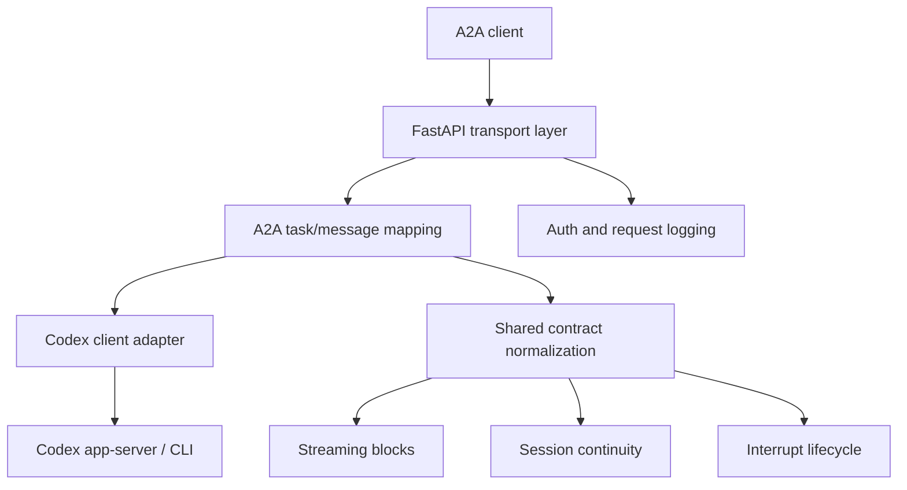

# codex-a2a-server

> Turn Codex into a stateful, production-oriented A2A agent service.

`codex-a2a-server` exposes Codex through standard A2A interfaces and adds the
operational pieces that raw agent runtimes usually do not provide by default:
authentication, session continuity, streaming contracts, interrupt handling,
and documentation for running it as a service.

## Fast Start

For most users, the published CLI is the default path. Install it with
`uv tool`, point it at a workspace, and start the service directly:

```bash
uv tool install codex-a2a-server
export A2A_BEARER_TOKEN="$(python -c 'import secrets; print(secrets.token_hex(24))')"
CODEX_WORKSPACE_ROOT=/abs/path/to/workspace codex-a2a-server
```

Before starting:

- install and verify the local `codex` CLI itself
- make sure Codex provider/model/auth configuration already works outside this repository
- expect startup to fail fast if the local `codex` runtime is missing or cannot initialize

Contributors working on unreleased changes should use the source-tree path
instead: `uv sync --all-extras` then `uv run codex-a2a-server`.

Use the docs by task:

- [Usage Guide](docs/guide.md) for configuration, API contracts, and full startup examples
- [Architecture Guide](docs/architecture.md) for responsibilities and request flow
- [Contributing Guide](CONTRIBUTING.md) for branch, validation, and review workflow

## Why This Project Exists

Most coding agents are built first as interactive tools, not as reusable
service endpoints. This project turns Codex into an agent service that can be
embedded into applications, gateways, and orchestration systems without
forcing each consumer to re-implement transport bridging, auth, or runtime
operations.

In practice, `codex-a2a-server` acts as:

- a protocol bridge from A2A to Codex
- a security boundary around the Codex runtime
- a stable contract layer for session, streaming, and interrupt behaviors

## Vision

Build a reusable adapter layer that lets coding agents behave like service
infrastructure rather than local-only tools:

- standard transport contracts instead of provider-specific glue
- explicit runtime boundaries instead of ad-hoc shell wrappers
- production-friendly runtime behavior and observability instead of demo-only setups

## What It Already Provides

- A2A HTTP+JSON and JSON-RPC entrypoints for Codex
- SSE streaming with normalized `text`, `reasoning`, and `tool_call` blocks
- session continuation and session query extensions
- interrupt lifecycle mapping and callback validation
- bearer-token auth, payload logging controls, and secret-handling guardrails
- released-CLI startup and source-based runtime paths

## Logical Components



This repository does not change what Codex fundamentally is. It wraps Codex in
a service layer that makes the runtime consumable through stable agent-facing
contracts.

More detail: [Architecture Guide](docs/architecture.md)

## Security Model

This project improves the service boundary around Codex, but it is not a hard
multi-tenant isolation layer.

One running instance should be treated as a single-tenant trust boundary with
a shared workspace/environment.

- the underlying Codex runtime may still need provider credentials
- one instance is not tenant-isolated by default
- local runtime setup still needs a controlled environment

Read before use:

- [SECURITY.md](SECURITY.md)

## Recommended Client Side

If you want a client-side integration layer to consume this service, prefer
[a2a-client-hub](https://github.com/liujuanjuan1984/a2a-client-hub).

It is a better place for client concerns such as A2A consumption, upstream
adapter normalization, and application-facing integration, while
`codex-a2a-server` stays focused on the server/runtime boundary around Codex.

## Install Released CLI

Install the latest release:

```bash
uv tool install codex-a2a-server
```

Upgrade an existing installation:

```bash
uv tool upgrade codex-a2a-server
```

Install an exact release:

```bash
uv tool install "codex-a2a-server==<version>"
```

Before starting the runtime:

- Install and verify the local `codex` CLI itself.
- Configure Codex with a working provider/model setup and any required credentials.
- `codex-a2a-server` does not provision Codex providers, login state, or API keys for you.
- Startup fails fast if the local `codex` runtime is missing or cannot initialize.

Self-start the released CLI against a workspace root:

```bash
export A2A_BEARER_TOKEN="$(python -c 'import secrets; print(secrets.token_hex(24))')"
A2A_HOST=127.0.0.1 \
A2A_PORT=8000 \
A2A_PUBLIC_URL=http://127.0.0.1:8000 \
CODEX_WORKSPACE_ROOT=/abs/path/to/workspace \
codex-a2a-server
```

Default address: `http://127.0.0.1:8000`

For a longer self-start example with model and timeout overrides, use the
[Usage Guide](docs/guide.md).

## Release Model

Released versions are published to PyPI and mapped to Git tags / GitHub
Releases.

- create a PR from the working branch
- merge into `main` after human review
- create a `v*` tag only from a commit already contained in `main`
- let the tag trigger PyPI and GitHub Release publication

This repository does not publish directly from an unmerged feature branch.

## Development From Source

Use the repository checkout directly only for development, local debugging, or
validation against unreleased changes on `main`.

1. Install dependencies:

```bash
uv sync --all-extras
```

2. Make sure local Codex is already usable:

- verify `codex` is installed and available on `PATH` (or set `CODEX_CLI_BIN`)
- verify Codex provider/auth configuration already works outside this repository

3. Generate a local bearer token:

```bash
export A2A_BEARER_TOKEN="$(python -c 'import secrets; print(secrets.token_hex(24))')"
```

4. Start this service from the source tree:

```bash
CODEX_WORKSPACE_ROOT=/abs/path/to/workspace uv run codex-a2a-server
```

5. Open the Agent Card:

- `http://127.0.0.1:8000/.well-known/agent-card.json`

For configuration, transport examples, and protocol details, use the dedicated
docs instead of the root README.

## Documentation Map

- [Architecture Guide](docs/architecture.md)
  System structure, boundaries, and request flow.
- [Usage Guide](docs/guide.md)
  Configuration, API contracts, client examples, streaming/session/interrupt
  details.
- [Compatibility Guide](docs/compatibility.md)
  Supported Python/runtime surface, extension stability, and ecosystem-facing
  compatibility expectations.
- [Contributing Guide](CONTRIBUTING.md)
  Contributor workflow, validation baseline, and change expectations.
- [Scripts Reference](scripts/README.md)
  Remaining repository-maintainer scripts and when to use them.
- [Vendored Codex References](vendor/codex/SYNC.md)
  Upstream Codex snapshots kept for offline reference and schema comparison;
  they are not the primary source of this repository's service guarantees.
- [Security Policy](SECURITY.md)
  Threat model, deployment caveats, and vulnerability disclosure guidance.

## Development

Baseline validation:

```bash
uv run pre-commit run --all-files
uv run pytest
```

## License

Apache License 2.0. See [LICENSE](LICENSE).
