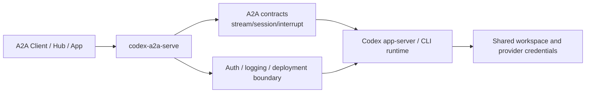

# Architecture Guide

This document explains what `codex-a2a-serve` is responsible for, what remains
inside Codex, and how requests move through the service.

## System Role

`codex-a2a-serve` is an adapter layer between A2A clients and the Codex
runtime.

It is responsible for:

- exposing A2A-facing HTTP+JSON and JSON-RPC endpoints
- normalizing stream, session, and interrupt contracts
- applying authentication, logging, and deployment-side guardrails
- providing deployment tooling for long-running or lightweight service modes

It is not responsible for:

- replacing Codex's own model/provider capability logic
- providing tenant isolation across multiple consumers by default
- hiding the fact that Codex may still need provider credentials at runtime

## Adapter Layers

This view emphasizes service responsibility boundaries rather than internal
module structure. The root [README](../README.md) keeps the more
implementation-oriented logical component view for first-time readers.

## Request Flow

### Standard send/stream flow

1. Client calls the REST or JSON-RPC endpoint.
2. FastAPI validates transport shape and auth.
3. The adapter translates A2A message/task semantics into Codex runtime calls.
4. Codex runtime emits session events, stream chunks, and interrupt requests.
5. The service maps those into shared A2A-facing contracts before returning
   them to the client.

### Streaming flow

For streaming requests, the service does more than simple passthrough:

- classifies stream blocks into shared types such as `text`, `reasoning`, and
  `tool_call`
- preserves ordering and identity metadata
- emits interrupt lifecycle status updates
- publishes normalized usage data in final metadata when available

Detailed streaming contract: [Usage Guide](guide.md)

### Session flow

The service keeps a shared session continuation contract around
`metadata.shared.session.id`, so clients can continue an existing Codex
conversation without binding directly to provider-private request formats.

### Interrupt flow

When Codex asks for permission or answers, the service exposes:

- shared asked/resolved lifecycle metadata in stream status events
- callback methods through A2A JSON-RPC extensions
- lifecycle and type validation before forwarding callback replies

## Boundary Model

The service introduces a boundary, but not a full trust boundary.

### What the service boundary helps with

- stable client-facing contract shape
- auth enforcement on A2A entrypoints
- payload logging controls
- safer deployment defaults for runtime secrets

### What still belongs to the Codex runtime boundary

- provider credential consumption
- workspace execution side effects
- model/provider-specific runtime behavior

That is why deployments should still be treated as trusted or controlled unless
stronger isolation is added.

## Documentation Split

Use the docs by responsibility:

- [README](../README.md): project overview, value, vision, progress, and entry
  navigation
- [Usage Guide](guide.md): configuration and protocol details
- [Deployment Guide](deployment.md): operational setup and secret handling
- [Script Guide](../scripts/README.md): script entrypoints and purpose
- [Security Policy](../SECURITY.md): threat model and disclosure guidance
